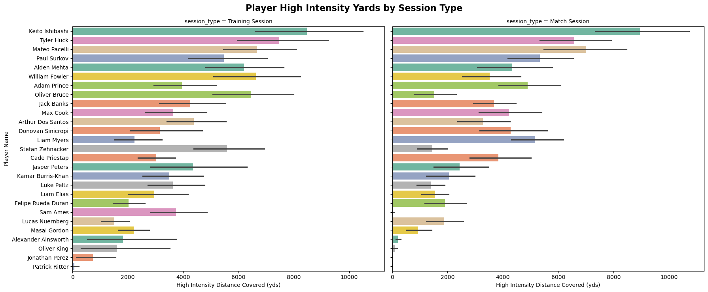
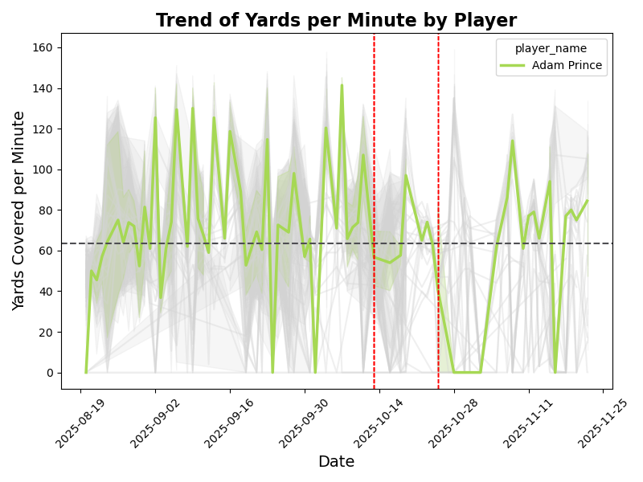

## Bowdoin Soccer GPS Player Tracking - Injury Risk Analysis
Ryan Houseman

### Project Proposal 2/15/26
#### Stakeholders
* Bowdoin Soccer Coaching Staff: Scott Wiercinski (swiercin@bowdoin.edu) & Andrew Banadda (a.banadda@bowdoin.edu)

#### Story
* In the Fall 2025 Season, the Bowdoin College soccer team began wearing GPS tracking devices for all of their practices and games.  Many other collegiate teams across many sports are beginning to do the same thing.
  The service the Bowdoin team uses provides some high level reports on this data, but at the college level, coaches often don't have the resources/ability to do their own in depth analysis.
  The Bowdoin Men's Soccer coaching staff is hopoing to use the GPS tracking data to build a model and reporting on player injury risk.  
 
* For each player, the GPS device tracks their position on the field throughout a training session or match.  As part of this, a number of other metrics are gethered such as distance run, # of sprints, time spent sprinting, accelerations, etc.
  Given the high physical workload, muscular injuries related to overuse are very common in college soccer.  My plan is to use this data to build a model predicting when players begin to show signs of fatigue and overuse.
  The coaching staff could then use these results to help manage player workloads and hopefully prevent more serious injuries.  
 
* There's a lot of room for different ML work on this data, but I think there's also a good use case for some sort of front end reporting/data visualization.

#### Data 
* GPS player tracking data results
    * Includes various quantitative metrics on speed, distance, acceleration/deceleration
    * Categorical values related to player position, and training session/match information
    * Data includes ~5000 records of of player data for 28 players over the course of the fall season.  Data is available in CSV format. 
*  Injury report data available in CSV format detailing plaeyer injuries throughout the fall season
*  Both datasets were provided by stakeholders.  Some blinding may be required if this were to be made public

#### Goals & Contribution 
The primary goal for this project is two-fold.  
1. Build a model that can effectively identify and flag players that are at an elevated risk for overuse injury and would benefit from additional rest/rehab.  
2. Deliver a process for refreshing data and regenerating results that is easy to run for the coaching staff, as well as front end reporting and data visualization highlighting model results.  Ideally, the coaching staff could download GPS data once or twice a week, 
have a push button process for running the model, and then have access to reporting results that are automatically refreshed.  The stakeholders could then use this information to help dictate and inform practice plans and player maintenance strategies.  This is especially 
important for players who have no current limitations imposed by athletic training staff, but may have a higher risk of incurring an injury.

#### EDA
At this point I have uploaded, cleaned, and linked the GPS and Injury datasets.  The code for this part of the process is located in ./src/data_prep.py The final prepped dataset is called ./data/bms_data_2026.csv 
The dataset includes 
* Linked data by player and date for the GPS and Injury datasets
* One Hot Encoded variables for player position, and session type categorical variables
* Various flags for player injuries such as (previous injuries, any injury throughout the season, an injury in the upcoming week, etc.)
  * I have setup a specific category for Overuse related injuries and added flags for these as well
 
Initial Plots (various other plots are saved in ./figures
Code for data exploration and plotting is saved in .src/eda.py.  This includes several plotting functions that I plan to build on for eventual results and reporting.  I would also like to explore the use of Observable Notebooks for web-based data visualization later on in the project.

**Plot 1:**
This plot shows season totals of high intensity yards covered by player and session type.  Similarly, I've plotted total distance by player.  Players that were healthy throughout the season consistently ran several hundred miles in both practices and matches.  That's a lot of wear and tear! 

**Plot 2:**
This plot highlights one players yards per minute metric as the season progressed.  This is a player who consistently ranked highly for several metrics, and also suffered several overuse injuries in the back half of the season flagged with vertical red-dashes.

The linkage between the GPS data and Injuries is working as expected (I've performed substantial QA to confirm this).  At this point, I'm ready to begin developing the injury risk models.  This is discussed in more detail in plan.md.   
